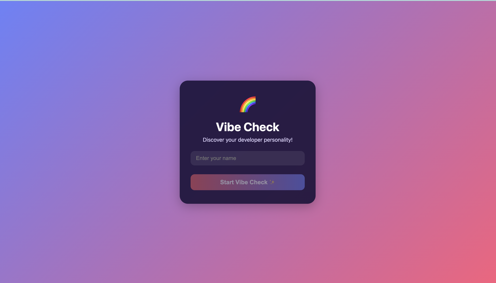
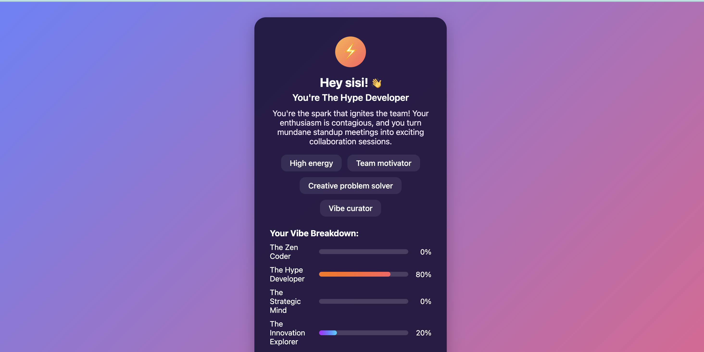

# VibeCheck 🎵✨

VibeCheck is an interactive web application that helps users discover and explore different vibes, moods, or atmospheres. Whether you're looking to set the perfect mood for your day or discover new experiences, VibeCheck provides an intuitive interface to explore various vibes.

## ✨ Features
- **Real-time Vibe Analysis**: Instant mood and sentiment detection
- **Interactive UI**: Smooth, responsive user interface
- **Social Integration**: Share vibes with friends and community
- **Analytics Dashboard**: Track vibe patterns over time
- **Mobile Responsive**: Works seamlessly across all devices
- **Fast Performance**: Optimized React application with efficient rendering
- **Easy Navigation**: Intuitive user interface for seamless experience



## 🛠 Tech Stack

- **Frontend**: React.js
- **Build Tool**: Create React App
- **Styling**: CSS3/Modern CSS
- **Deployment**: Vercel
- **Package Manager**: npm/yarn

## 🚀 Getting Started

### Prerequisites

Make sure you have the following installed on your machine:
- [npm](https://www.npmjs.com/)

### Installation

1. **Clone the repository**
   ```bash
   git clone https://github.com/SiddhiSinghal/vibecheck.git
   cd vibecheck
   ```

2. **Install dependencies**
   ```bash
   npm install
   ```

3. **Start the development server**
   ```bash
   npm start
   ```

4. **Open your browser**
   
   Navigate to [http://localhost:3000](http://localhost:3000) to view the application.

## 📜 Available Scripts

In the project directory, you can run:

### `npm start`
Runs the app in development mode. The page will reload when you make changes, and you may also see any lint errors in the console.

## 📁 Project Structure

```
vibecheck/
├── public/
│   ├── index.html
│   ├── favicon.ico
│   └── manifest.json
├── src/
│   ├── components/
│   ├── pages/
│   ├── styles/
│   ├── App.js
│   ├── App.css
│   └── index.js
├── package.json
├── README.md
└── .gitignore
```

## 👤 Author

**Siddhi Singhal**
- GitHub: [@SiddhiSinghal](https://github.com/SiddhiSinghal)
- Live Demo : [link](https://vibecheck-nu.vercel.app/)
